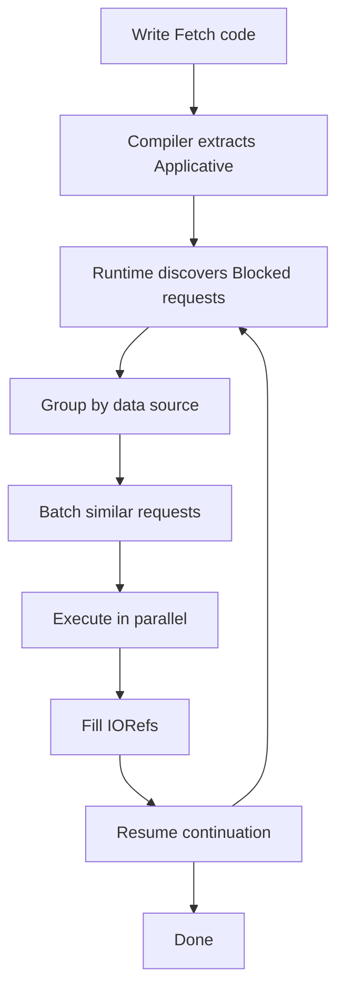

# There is no Fork: an Abstraction for Efficient, Concurrent, and Concise Data Access

Simon Marlow, Louis Brandy, Jonathan Coens, Jon Purdy

<div class="abs-br m-6 text-sm">
  <a href="https://dl.acm.org/doi/10.1145/2628136.2628144" target="_blank">
    Paper
  </a>
</div>

<style>
h1 {
  font-size: 2.5rem !important;
  text-wrap: pretty;
}
</style>

<!--
Facebook's approach to efficient data fetching at scale.
This paper introduces Haxl, a framework that makes concurrency implicit in data-fetching operations.
-->

---

# What's wrong with Data Access?

What makes it inefficient, sequential and flaky?

<v-clicks>

I/O

- It's slow.


</v-clicks>

<!--
So what happened? What's wrong with data access? We've seen the title but what exactly makes it inefficient, or sequential, or flaky/brittle?
-->

---

# What's wrong with Data Access?

What makes it inefficient, sequential and flaky?

I/O

- It's slow.

<v-clicks>

- It's hard to test.


- It's hard to debug.

<div class="w-96 mt-4">
  <blockquote class="flex flex-col gap-1">
    <p class="text-lg">
      “It breaks on my machine.”
    </p>
    <p class="text-right text-lg">—<cite>Your No. 1. Customer</cite></p>
  </blockquote>
</div>

<div class="flex gap-4 items-center">
  
  <p class="text-lg w-80">
    Haxl - The framework that solves
    these problems (almost).
  </p>
</div>

</v-clicks>

---

# Concurrency

You know good about concurrency:

<div v-click class="flex flex-col gap-4">
  <div class="flex gap-4 justify-between">
    <p class="text-2xl">Java</p>

```java
CompletableFuture f1 = ...;
CompletableFuture f2 = ...;
allOf(f1, f2).join();
```

  </div>

  <div class="flex gap-4 justify-between">
    <p class="text-2xl">JavaScript</p>

```javascript
const [r1, r2] = await Promise.all([thing1, thing2])
```

  </div>

  <div class="flex gap-4 justify-between">
    <p class="text-2xl">Python 3</p>

```python
r1,r2 = await asyncio.wait([thing1(),thing2()])
```

  </div>

  <div class="flex gap-4 justify-between">
    <p class="text-2xl">Haskell</p>

```haskell
(r1,r2) <- concurrently thing1 thing2
```

  </div>
</div>

<style>
pre {
  width: 36rem !important;
  font-size: 1rem !important;
}
</style>

---

# What's wrong with this then?

<v-clicks>

1. Mental overhead
    - You have to remember to do so
2. Performance
    - You might wait too early
    - ```java
      CompletableFuture f = ...;
      var result = f.join(); // blocks the execution to wait
      heavyComputation();    // could have been done during waiting!
      ```
3. <span class="text-blue-500">Colored</span> <span class="text-red-500">functions</span>
    - <span class="text-blue-500">Synchronous</span> functions and <span class="text-red-500">asynchronous</span> functions cannot be called isomorphically
    - Crafting concurrency imports **extra structure** to the code

</v-clicks>

<style>
li {
  font-size: 1.25rem !important;
}

pre {
  font-size: 1rem !important;
}
</style>

---

# Why not concurrency by default?

Why sequential by default?

<v-clicks>

- Side effects
- But how often?
- What about when it comes to data access?

<p class="text-center !mt-8 text-lg">


The first two steps are side-effects free.

</p>

- Real-world examples
  - Web page rendering
  - Build system, etc.

</v-clicks>

<style>
li {
  font-size: 1.25rem !important;
}
</style>

---

# Why not concurrency by default?

Example: the Events API


---

# Haxl

Haxl is a Haskell library that simplifies access to remote data, such as databases or web-based services.

- Haxl provides an abstraction over concurrent I/O

| Layer          | Primitive                             | What It Does            |
|----------------|---------------------------------------|-------------------------|
| Declaration    | `Request`                           | Define WHAT data exists |
| Implementation | `DataSource`                        | Define HOW to get it    |
| Composition    | `Fetch`, `<*>`, `>>=`               | Describe WHAT you need  |
| Execution      | `runFetch`                          | When to actually fetch  |

- Enables writing sequential code that gets maximum concurrency automatically
- Provides batching and built-in caching

<style>
table {
  font-size: 0.8rem !important;
  margin-top: .75rem !important;
  margin-bottom: 1rem !important;
}
</style>

---

# Example: Events API

<div class="flex gap-4 justify-between items-center">

```haskell
data Request a where
  GetEventUris :: Request [EventUri]
  GetSids      :: Request [Sid]
  GetEvents    :: [EventUri] -> [Sid] -> Request [Event]
  GetEventMeta :: EventUri -> Request EventMeta
  GetIdcName   :: Event -> Request IdcName

do
  eventUris <- getEventUris
  sids <- getSids
  events <- getEvents eventUris sids
  eventMetas <- mapM getEventMeta events
  idcNames <- mapM getIdcName events
  ...
```


</div>

<style>
pre {
  width: 30rem !important;
  font-size: 0.8rem !important;
}
</style>

---

# How it works (really briefly)

Crux: How to discover and express the independence of computations?

Expression: Applicative `<*>` instead of Monad `>>=`

- `>>=` combines things sequentially
- `<*>` combines things in parallel

```haskell
(>>=) :: Monad       m => m a        -> (a -> m b) -> m b

(<*>) :: Applicative f => f (a -> b) -> f a        -> f b
```

As `<*>` implemented by Haxl,
it can discover the independence of computations
and combine them in parallel.

<style>
pre {
  margin-top: 1.5rem !important;
  margin-bottom: 2rem !important;
  font-size: 1rem !important;
}
</style>

---

# How it works (really briefly)

Crux: How to discover and express the independence of computations?

Data-dependencies aren't first-class
- thus compiler support is needed

<v-click>

The ApplicativeDo compiler extension (Added to GHC 8.0, 2016)

```haskell
do
  eventUris <- getEventUris
  sids <- getSids
```

Turns into (with ApplicativeDo):

```haskell
do
  (eventUris, sids) <- (,) <$> getEventUris <*> getSids
```

</v-click>

<style>
pre {
  font-size: 1rem !important;
}
</style>

---

# How it works (really briefly)

The overall process

```haskell
do
  eventUris <- getEventUris
  sids <- getSids
```

compiles to

```haskell
do
  (eventUris, sids) <- (,) <$> getEventUris <*> getSids
```

reduces to (runtime)

```haskell
fetch [GetEventUris, GetSids]
```

Haxl will call the `fetch` function with the list of requests
and wait for the results.

<style>
pre {
  font-size: 1rem !important;
}
</style>

---

# Batching & Caching

When your I/O becomes data

Batching

- Dependant on the `DataSource` implementation
- Reduces network round trips

Caching

- A local per-run cache that stores
- Performance
- Correctness (consistent view of data within one run)
- Modularity (no need to coordinate caching between components)
- Debuggability - The cache records all the I/O that happened
    - Can be dumped for repro/diagnose

---

# Haxl in Facebook

- Sigma, the rule engine for spam detection
- Generates Haskell code (over 100k loc) from rules

---

# Haxl

Consider building a service that needs data from multiple sources:

<v-clicks>

- Web page rendering: databases, caches, APIs, microservices
- Spam detection: user data, social graph, content analysis
- Analytics: data warehouses, real-time streams

</v-clicks>

<v-click>

<div class="mt-8 p-4 bg-amber-50 rounded">

**The Challenge**: How do you keep your code clean while executing efficiently?

</div>

</v-click>

<!--
From paper introduction. This is the common pattern - services that orchestrate data from many backends.

More examples:
- E-commerce: product DB + inventory service + recommendation engine + user preferences
- Social media: posts DB + friends graph + likes counter + comment service
- Financial: account DB + transaction history + risk scoring + market data

The tension: Simple code is slow, fast code is complex. This slide sets up that tension.
-->

---

# The Concurrency Dilemma

<div class="grid grid-cols-2 gap-4">

<div>

### Option A: Sequential Code

```python
posts = get_all_posts()
for post in posts[:5]:
    content = get_post_content(post.id)
    # Slow! N+1 queries
```

<v-click>

✅ Simple and clean
❌ Executes sequentially (slow)

</v-click>

</div>

<div>

### Option B: Manual Concurrency

```python
async def render():
    posts_task = asyncio.create_task(
        get_all_posts())
    # ...manage futures, awaits...
    # ...coordinate dependencies...
```

<v-click>

✅ Fast execution
❌ Complex, cluttered, brittle

</v-click>

</div>

</div>

<v-click>

<div class="mt-8 text-center text-xl">

**Can we have both?** 🤔

</div>

</v-click>

<!--
From the talk notes. This is the fundamental tension.

Problems with manual concurrency:
- Must remember where to parallelize
- Code becomes cluttered with async/await
- Refactoring is harder (have to fix awaits)
- Easy to introduce bugs (race conditions, deadlocks)

Show concrete examples that the audience can relate to.
-->

---

# A Key Observation

Many applications follow this pattern:

<v-clicks>

1. **Read data** from multiple sources
2. **Compute** results based on that data
3. **Take action** (write, render, respond)

</v-clicks>

<v-click>

<div class="mt-8 p-4 bg-blue-50 rounded">

**Key insight**: The reading phase has <span class="text-red-500 font-bold">no side effects</span>

When there are no side effects, **order doesn't matter**

</div>

</v-click>

<v-click>

<div class="mt-6 text-center text-xl">

What if concurrency could be **implicit**?

</div>

</v-click>

<!--
From the talk. This is the crucial insight that enables Haxl.

No side effects means:
- Safe to reorder operations
- Safe to execute in parallel
- Safe to cache and replay
- Safe to optimize automatically

This is why Haxl focuses on read-only operations. Writes happen after, outside the Haxl computation.

Example: Rendering a web page
- Fetch user info, posts, comments, likes (reads - no side effects)
- Compute the HTML (pure computation)
- Send response (side effect, happens after)

The first step is where Haxl shines.
-->

---
layout: center
class: text-center
---

# Introducing Haxl

<!--
Transition slide to introduce the solution.
-->

---

# What is Haxl?

<v-clicks>

- An embedded DSL in Haskell for data fetching
- Makes concurrency **implicit** in the `<*>` operator
- You write simple code, the framework extracts parallelism

</v-clicks>

<v-click>

<div class="mt-8 p-4 bg-green-50 rounded">

**The key idea**: Concurrency emerges from code structure, not explicit instructions

</div>

</v-click>

<v-click>

<div class="mt-6">

```haskell
-- This looks sequential, but executes in parallel!
renderPage <$> leftPane <*> mainPane
```

</div>

</v-click>

<!--
From paper abstract. Haxl = library + programming pattern, not a separate language.

The <*> operator (Applicative) is the key. It allows the framework to inspect both arguments and discover what can run in parallel.

Haxl is a Haskell library - it's not a new language. It uses Haskell's type system and operator overloading to achieve implicit concurrency.
-->

---

# A Concrete Example: Blog Rendering

Let's see Haxl in action with a real scenario:

<v-clicks>

**Task**: Render a blog homepage

- Show the 5 most recent post summaries in the **left pane**
- Show the full content of the most popular post in the **main pane**

</v-clicks>

<v-click>

<div class="mt-8">

**Required data:**

<div class="grid grid-cols-2 gap-4 mt-4">

<div>

Left pane:
- Post IDs (from index)
- Post info for each (title, author, date)

</div>

<div>

Main pane:
- Post IDs (from index)
- Most viewed post
- Full post content

</div>

</div>

</div>

</v-click>

<!--
From the paper Section 2. This is the running example used throughout.

Notice the data dependencies:
- Need post IDs before fetching post info
- Need post IDs before finding most viewed
- No dependency between left pane and main pane

This structure is what enables Haxl's automatic concurrency.
-->

---

# The Data Operations

Define primitive fetch operations for each data source:

```haskell
-- Get all post IDs from the index
getPostIds :: Fetch [PostId]

-- Get metadata for a post
getPostInfo :: PostId -> Fetch PostInfo

-- Get view count for a post
getPostViews :: PostId -> Fetch Int

-- Get full content of a post
getPostContent :: PostId -> Fetch PostContent
```

<v-click>

<div class="mt-8 p-4 bg-gray-50 rounded">

These are just **declarations** - you implement the actual fetching logic once per data source.

Haxl handles the orchestration.

</div>

</v-click>

<!--
These are the building blocks. Each represents a single fetch operation.

In practice, you'd implement:
- getPostIds might query a database or cache
- getPostInfo could be a REST API call
- getPostViews might query an analytics service
- getPostContent could read from object storage

The key: you write each fetch independently. Haxl combines them efficiently.
-->

---

# The Implementation

<div class="grid grid-cols-2 gap-4">

<div>

### Left Pane

```haskell
leftPane = do
  postIds <- getPostIds
  let top5 = take 5 postIds
  postInfos <- mapM getPostInfo top5
  return (renderSummaries postInfos)
```

</div>

<div>

### Main Pane

```haskell
mainPane = do
  postIds <- getPostIds
  views <- mapM getPostViews postIds
  let popular = maxBy views postIds
  content <- getPostContent popular
  return (renderPost content)
```

</div>

</div>

<v-click>

<div class="mt-6">

### Combine them

```haskell
blog :: Fetch Html
blog = renderPage <$> leftPane <*> mainPane
```

</div>

</v-click>

<v-click>

<div class="mt-4 p-4 bg-purple-50 rounded">

Notice: No `async`, no `await`, no thread management. Just simple, sequential-looking code.

</div>

</v-click>

<!--
From paper Section 2.1. This is the actual code.

Key observations:
- Each pane looks sequential (do notation / >>=)
- Within each pane, there are data dependencies
- The <*> operator between panes is where Haxl extracts parallelism
- mapM will be executed using the Applicative traverse, so the getPostInfo/getPostViews calls batch together

The programmer didn't specify ANY concurrency explicitly!
-->

---

# Automatic Execution in Rounds

Haxl analyzes the code and executes in **3 rounds**:

<v-clicks>

**Round 1**: Fetch both `getPostIds` calls in parallel (even though written separately!)

**Round 2**: Once IDs are available, fetch:
- `getPostInfo` for 5 posts (batched into 1 request)
- `getPostViews` for all posts (batched into 1 request)

These run **in parallel** across data sources.

**Round 3**: Once popular post is known, fetch `getPostContent`

</v-clicks>

<v-click>

<div class="mt-6 p-4 bg-green-50 rounded">

**Result**: 3 rounds instead of 10+ sequential calls. No manual coordination needed.

</div>

</v-click>

<!--
From the talk notes and paper Figure 2.

This is the rounds tree diagram in action. Each round executes all independent fetches concurrently and batches requests to the same data source.

Without Haxl:
- Sequential: 1 + 5 + N + 1 = N+7 round trips
- Manual async: Still need to coordinate dependencies carefully

With Haxl: 3 rounds automatically.

The batching also means:
- 5 separate getPostInfo calls → 1 batch request
- N separate getPostViews calls → 1 batch request

Huge latency and RPC savings!
-->

---
layout: center
class: text-center
---

# How Does It Work?

<!--
Transition to the technical implementation.
-->

---

# The Fetch Monad

At its core, a `Fetch a` computation can be in one of three states:

<v-clicks>

```haskell
data Result a
  = Done a                    -- Result is ready
  | Blocked br (Fetch a)      -- Waiting on requests, then continue
  | Throw Exception           -- Error occurred
```

</v-clicks>

<v-click>

<div class="mt-8 p-4 bg-blue-50 rounded">

**Key insight**: A `Fetch` computation is a **state machine** that can pause when it needs data.

</div>

</v-click>

<v-click>

<div class="mt-6">

When blocked, it carries:
- `br`: All pending requests discovered so far
- `Fetch a`: The continuation (what to do after data arrives)

</div>

</v-click>

<!--
From paper Section 3. The three states represent the execution lifecycle.

Done: Computation finished, value available
Blocked: Computation paused, waiting for data fetches to complete
Throw: Exception handling (covered later)

The blocked state is where all the magic happens - it accumulates requests from multiple branches of computation and then executes them all at once.

This is fundamentally different from traditional async/await where you await one thing at a time.
-->

---

# Monad vs Applicative

Two ways to compose `Fetch` operations:

<div class="grid grid-cols-2 gap-4 mt-6">

<div>

### Monad (`>>=`)

```haskell
do
  ids <- getPostIds
  info <- getPostInfo ids
  return info
```

<v-click>

**Sequential**: `info` depends on `ids`

Must execute one after the other

</v-click>

</div>

<div>

### Applicative (`<*>`)

```haskell
renderPage <$> leftPane
           <*> mainPane
```

<v-click>

**Parallel**: No dependency between panes

Can execute simultaneously

</v-click>

</div>

</div>

<v-click>

<div class="mt-8 p-4 bg-purple-50 rounded">

Haxl uses both: Monad for dependencies, Applicative for concurrency

</div>

</v-click>

<!--
From talk notes and sum-by-gpt.md. This is the fundamental distinction.

Monad (>>=):
- Type: m a -> (a -> m b) -> m b
- The second computation depends on the result of the first
- Forces sequencing

Applicative (<*>):
- Type: f (a -> b) -> f a -> f b
- Both sides are independent
- Allows parallel execution

The genius of Haxl: You get both. The compiler (with ApplicativeDo) or you manually choose the right operator based on actual data dependencies.

Within each pane in the blog example, there ARE dependencies (need IDs before fetching info), so we use Monad.
Between panes, there are NO dependencies, so we use Applicative.
-->

---

# The Applicative Magic

How does `<*>` discover parallelism?

```haskell
instance Applicative Fetch where
  Done f    <*> Done x    = Done (f x)
  Done f    <*> Blocked c = Blocked (f <$> c)
  Blocked c <*> Done x    = Blocked (c <*> Done x)
  Blocked c <*> Blocked d = Blocked (c <*> d)  -- ✨
```

<v-click>

<div class="mt-6 p-4 bg-green-50 rounded">

**The key**: When both sides are `Blocked`, combine their request sets!

`Blocked c <*> Blocked d` = blocked on **both** c and d

</div>

</v-click>

<v-click>

<div class="mt-6">

This allows the runtime to:
1. Look inside **both** arguments
2. Discover **all** pending requests
3. Execute them **in parallel**

</div>

</v-click>

<!--
From q-n-a-with-gpt.md Q1. This is the core of Haxl's design.

The Applicative instance is special because it explores both arguments to find blocked requests.

Compare to normal Applicative for Maybe or List - they just apply functions.

But Haxl's Applicative:
- Inspects the structure
- Collects all pending I/O
- Merges them into a single Blocked state
- This merged state gets executed as one batch

Example:
leftPane = Blocked {getPostInfo for 5 posts} cont1
mainPane = Blocked {getPostViews for all posts} cont2

leftPane <*> mainPane = Blocked {getPostInfo, getPostViews} (cont1 <*> cont2)

The runtime sees one Blocked with multiple requests and executes them all concurrently!
-->

---

# Execution Loop

The runtime repeatedly runs this simple loop:

<v-clicks>

```haskell
runFetch :: Fetch a -> IO a
runFetch computation = do
  result <- step computation
  case result of
    Done a              -> return a
    Blocked requests k  -> do
      performFetches requests  -- Execute batch in parallel
      runFetch k               -- Resume with continuation
```

**Round** = One iteration of this loop

Each round executes all discovered requests concurrently

</v-clicks>

<v-click>

<div class="mt-6 p-4 bg-amber-50 rounded">

The computation pauses at each `Blocked`, executes all requests together, then resumes.

</div>

</v-click>

<!--
From q-n-a-with-gpt.md Q2. This is the execution engine.

The pattern:
1. Run the computation until it blocks
2. Collect all pending requests (from Applicative composition)
3. Batch and execute them in parallel
4. Resume the continuation
5. Repeat until Done

This is fundamentally different from sequential execution:
- Sequential: fetch, wait, fetch, wait...
- Haxl: collect, fetch all, resume, collect, fetch all, resume...

The rounds correspond to "layers" of data dependencies in your computation.

Example from blog:
Round 1: getPostIds (both panes need this)
Round 2: getPostInfo + getPostViews (independent, run together)
Round 3: getPostContent (depends on results from round 2)

Each round is one iteration of this loop.
-->

---
layout: center
class: text-center
---

# Implementation Details

<!--
Transition to practical implementation.
-->

---

# Implementing a Data Source

You provide the actual fetching logic by implementing a `DataSource`:

```haskell
-- Define your request type
data PostRequest a where
  GetPostIds     :: PostRequest [PostId]
  GetPostInfo    :: PostId -> PostRequest PostInfo
  GetPostContent :: PostId -> PostRequest PostContent

-- Implement the fetch function
instance DataSource PostRequest where
  fetch requests = do
    -- Group by request type
    -- Batch similar requests together
    -- Execute via your backend (SQL, HTTP, etc.)
    -- Fill in the results
```

<v-click>

<div class="mt-6 p-4 bg-blue-50 rounded">

You write the batching logic **once per data source**. Haxl handles all the orchestration.

</div>

</v-click>

<!--
From paper Section 4. This is the contract between you and Haxl.

You define:
1. Request types (what data you need)
2. How to batch and execute them

Haxl provides:
1. Discovery of what to fetch
2. When to fetch (rounds)
3. Caching and deduplication
4. Execution scheduling

The beauty: You implement batching once in the fetch function, then all uses of that data source automatically benefit from batching.
-->

---

# How Batching Works

When multiple requests target the same data source:

<v-clicks>

**Without batching**:
```python
# 5 separate HTTP calls
for post_id in [1, 2, 3, 4, 5]:
    info = http.get(f"/posts/{post_id}")
```

**With Haxl batching**:
```python
# Single batched call
infos = http.post("/posts/batch", ids=[1, 2, 3, 4, 5])
```

</v-clicks>

<v-click>

<div class="mt-8 p-4 bg-green-50 rounded">

Reduces network overhead, connection pooling, and backend load dramatically.

At Facebook: ~51% latency reduction in production!

</div>

</v-click>

<!--
From paper evaluation section. Real production numbers.

Batching benefits:
1. Fewer network round trips (1 instead of N)
2. Less protocol overhead (headers, handshakes)
3. Backend can optimize batch queries (single SQL with IN clause)
4. Better connection pool utilization

The 51% latency improvement was measured on Facebook's Sigma system (spam/malware detection) when they enabled automatic batching via Haxl.

This is huge for microservices architectures where you make many small calls.
-->

---

# BlockedRequest: The Secret Sauce

How does Haxl store different request types together?

<v-clicks>

```haskell
-- Existentially quantified type
data BlockedRequest where
  BlockedRequest :: Request req => req a -> IORef a -> BlockedRequest
```

Each blocked request contains:
- The request itself (any type!)
- An `IORef` to store the result

</v-clicks>

<v-click>

<div class="mt-8 p-4 bg-purple-50 rounded">

Haxl collects heterogeneous requests, groups by data source, executes batches, then fills the `IORef`s.

The continuation reads from these `IORef`s when it resumes.

</div>

</v-click>

<!--
From q-n-a-with-gpt.md Q2 and Q3. This is a key implementation detail.

Existential types allow storing different request types in the same collection:
- GetPostInfo Int and GetPostContent String are different types
- But both can be BlockedRequest

The IORef is like a promise/future:
1. Created empty when request is blocked
2. Filled by the fetch function after I/O completes
3. Read by the continuation when it resumes

This is how Haxl maintains type safety while batching heterogeneous requests.

Flow:
1. Applicative discovers: [GetPostInfo 1, GetPostInfo 2, GetPostContent 3]
2. Wrapped as BlockedRequests with empty IORefs
3. fetch function executes batches, writes to IORefs
4. Continuation resumes, reads from IORefs
5. Type safety maintained throughout!
-->

---

# ApplicativeDo: Automatic Optimization

Haskell's compiler extension automatically transforms code:

<div class="grid grid-cols-2 gap-4 mt-6">

<div>

### You write:

```haskell
do
  a <- fetch1
  b <- fetch2
  c <- fetch3
  return (f a b c)
```

</div>

<div>

### Compiler transforms to:

```haskell
f <$> fetch1
  <*> fetch2
  <*> fetch3
```

</div>

</div>

<v-click>

<div class="mt-8 p-4 bg-amber-50 rounded">

When there are no dependencies, the compiler automatically uses `<*>` instead of `>>=`

You get parallelism **for free**!

</div>

</v-click>

<!--
From talk notes and paper Section 7. ApplicativeDo is a GHC extension.

The compiler analyzes your do-notation code and determines:
- Which bindings depend on which
- When it's safe to use Applicative instead of Monad

This means:
- You can write natural imperative-looking code
- The compiler extracts maximum parallelism
- No need to manually rewrite with <*>

Limitation: Only works when there are no data dependencies.

If you write:
do
  a <- fetch1
  b <- fetch2 a  -- depends on a!
  return b

The compiler keeps it monadic (sequential) because b depends on a.

This is the "best of both worlds": write imperative code, get declarative parallelism.
-->

---

# Putting It All Together

<div class="text-center mt-8">



</div>

<v-click>

<div class="mt-8 p-4 bg-green-50 rounded text-center">

**Simple code → Automatic parallelism → Batched execution → Fast results**

</div>

</v-click>

<!--
Visual summary of the entire execution pipeline.

The flow:
1. Developer writes simple Fetch code
2. Compiler (ApplicativeDo) transforms to use <*> where possible
3. Runtime evaluates until Blocked
4. Groups requests by data source
5. Batches within each data source
6. Executes all batches in parallel
7. Fills result containers (IORefs)
8. Resumes computation with continuation
9. Repeats until Done

This diagram shows how all the pieces fit together:
- Applicative → discovery
- Blocked → collection
- Batching → efficiency
- Rounds → execution model
- Continuation → resumption

The user doesn't see most of this - they just write simple code and it runs fast!
-->

---
layout: center
class: text-center
---

# Bonus Features

<!--
Transition to additional benefits of Haxl.
-->

---

# Automatic Caching

Haxl maintains a per-request cache of all fetches:

<v-clicks>

**The cache ensures**:

1. **Deduplication**: Identical requests execute only once
2. **Consistency**: Same request returns same result within a computation
3. **Transparency**: Works automatically, no manual cache management

</v-clicks>

<v-click>

<div class="mt-8">

```haskell
do
  user1 <- getUser userId  -- Fetches from backend
  user2 <- getUser userId  -- Returns cached result (same computation)
  return (user1, user2)
```

</div>

</v-click>

<v-click>

<div class="mt-6 p-4 bg-blue-50 rounded">

Modular code can request the same data without worrying about duplicate fetches!

</div>

</v-click>

<!--
From talk notes. Caching is a crucial feature for performance AND correctness.

Benefits of automatic caching:

Performance:
- No redundant fetches for the same data
- Reduces load on backends

Correctness:
- Consistent view of data within one request
- Even if backend data changes mid-request, you see a snapshot

Modularity:
- Helper functions can freely request data
- No need to thread data through call stack
- No need for manual coordination to avoid duplicate fetches

Example: Multiple components need current user info
- Without caching: Each component fetches separately (wasteful)
- With manual caching: Need to pass user object around (coupling)
- With Haxl: Each component requests independently, fetched once automatically
-->

---

# Why Caching Matters

Beyond performance, caching provides:

<v-clicks>

**Correctness**: Consistent snapshot of data throughout the computation

**Modularity**: Write independent components without coordination

**Debuggability**: Cache can be dumped and replayed for debugging

**Testability**: Record cache during real runs, replay in tests

</v-clicks>

<v-click>

<div class="mt-8 p-4 bg-purple-50 rounded">

Example: In testing, you can record all I/O from a production run and replay it deterministically.

</div>

</v-click>

<!--
From talk notes and paper. These are non-obvious benefits that emerge from treating I/O as data.

Correctness:
- Within one request, you get a consistent view
- No race conditions from data changing mid-computation
- This is especially important for multi-step business logic

Modularity:
- You can extract helper functions without worrying about duplicate fetches
- No need to pass data through layers
- Each function requests what it needs

Debuggability:
- The cache records all I/O that happened
- On error, dump the cache
- Replay that exact sequence later to reproduce the bug
- Much better than traditional logging

Testability:
- Record actual production behavior
- Replay in test environment
- No need to mock every data source
- Tests are based on real data patterns

This is a huge productivity win - debugging production issues becomes much easier.
-->

---

# Exception Handling

Exceptions in data fetches are handled gracefully:

<v-clicks>

```haskell
-- Exceptions are captured and can be handled
result <- catch
  (getPostContent postId)
  (\e -> return defaultContent)
```

**Key properties**:
- Exceptions don't break the parallelism
- Failed requests don't block other requests
- You can catch and recover per-request

</v-clicks>

<v-click>

<div class="mt-8 p-4 bg-amber-50 rounded">

Partial failures are isolated - if one data source fails, others continue.

</div>

</v-click>

<!--
From paper Section 5. Exception handling is tricky in parallel systems.

Haxl's approach:
- Exceptions are represented in the Result type (Throw constructor)
- They propagate through the computation properly
- You can catch exceptions just like in normal Haskell code

Important: The parallel execution continues even if some requests fail.

Example:
- Fetching user info, posts, and friends in parallel
- User info fails (service down)
- Posts and friends still complete successfully
- You can catch the user info exception and use a default
- Or you can let it propagate

This is better than traditional fail-fast:
- In microservices, partial failures are common
- Better to get partial results than fail completely
- Haxl makes this natural to express

The exception handling respects the rounds model:
- If an exception occurs in a fetch, it's recorded
- The continuation receives the exception when it tries to read that result
- Other successful fetches in the same round are still available
-->

---
layout: center
class: text-center
---

# Why Haskell?

<!--
Transition to discussing the language choice.
-->

---

# Could This Work in Other Languages?

From Facebook engineer Louis Brandy on Hacker News:

<v-click>

> "If you understand the central idea of Haxl, I don't know of any other language that would let you do what Haxl in Haskell does."

</v-click>

<v-clicks>

**What makes Haskell special?**

1. **Type system**: Applicative and Monad as first-class concepts
2. **Operator overloading**: Can hijack `<*>` and `>>=` with custom semantics
3. **Laziness**: Computations can be inspected before execution
4. **Purity**: No hidden side effects, safe to reorder operations

</v-clicks>

<v-click>

<div class="mt-6 p-4 bg-blue-50 rounded">

The language features aren't just conveniences - they're **essential** to making this work.

</div>

</v-click>

<!--
From HN thread, lbrandy's comment about why Haskell.

Key points:
1. Applicative and Monad aren't just patterns, they're language-level abstractions
2. You can define what <*> and >>= mean for your types
3. This allows the DSL to feel natural and not bolted-on

Attempts in other languages (lbrandy mentions C++):
- "absolutely brutal mess of templates and hackery"
- Possible, but not practical or maintainable

The purity constraint is crucial:
- Can only reorder/parallelize because there are no side effects
- The type system enforces this
- Other languages with effects everywhere can't make the same guarantees

The laziness helps:
- Can build computation structures without executing them
- Can inspect them to extract requests
- Then execute strategically

Haxl clones exist (Stitch in Scala, Fetch in Scala, muse in Clojure) but none achieve the same naturalness.
-->

---

# From DSL to Real Language

Facebook's journey:

<v-clicks>

**Before Haxl**: Custom DSL (FXL)
- Great at: implicit concurrency and I/O scheduling
- Bad at: CPU, memory, debugging, tooling

**The problem**: As the system grew, needed a **real language**
- Full programming capabilities
- Rich ecosystem (libraries, tools, IDE support)
- Good debugging and profiling
- But still keep the concurrency magic!

</v-clicks>

<v-click>

<div class="mt-8 p-4 bg-green-50 rounded">

**Haskell**: The only language where they could embed their DSL naturally while getting a complete language ecosystem.

</div>

</v-click>

<!--
From HN thread, lbrandy explaining the evolution from FXL to Haxl.

The DSL was successful but created new problems:
- As usage grew, needed more than just data fetching
- Needed full programming language features
- Needed debugging tools, profilers, IDEs
- Didn't want to build all this for a homegrown DSL

The question: How to go from DSL to "an L" (a language)?

Options:
1. Build everything for FXL - huge investment
2. Pick an existing language - but lose the concurrency magic?

Haskell solved both:
- Full language with mature ecosystem
- Can embed the DSL naturally (EDSLs are a Haskell strength)
- Keep the implicit concurrency through Applicative

This is a common pattern:
- Start with DSL for specific domain
- DSL succeeds, outgrows its boundaries
- Need to migrate to real language
- Haskell's EDSL capabilities make this transition smooth

The migration story is interesting too - they compiled FXL to Haskell and ran both in parallel to verify correctness.
-->

---
layout: center
class: text-center
---

# What Do You Get?

<!--
Transition to wrapping up with key takeaways.
-->

---

# The Big Hammer

<div class="text-center mt-8">

**You write:**

<v-click>

Boilerplate for your data sources (once per source)

</v-click>

</div>

<v-click>

<div class="text-center mt-12 text-2xl font-bold">

**You get:**

</div>

</v-click>

<v-clicks>

<div class="grid grid-cols-2 gap-6 mt-8">

<div class="p-4 bg-blue-50 rounded">

✓ Automatic concurrency

✓ Automatic batching

</div>

<div class="p-4 bg-green-50 rounded">

✓ Automatic caching

✓ Automatic deduplication

</div>

<div class="p-4 bg-purple-50 rounded">

✓ Testability (record/replay)

✓ Debuggability (dump traces)

</div>

<div class="p-4 bg-amber-50 rounded">

✓ Simple, maintainable code

✓ Type safety throughout

</div>

</div>

</v-clicks>

<!--
From talk notes. This is Simon Marlow's "big hammer" metaphor.

You provide minimal input:
- Define request types
- Implement fetch function per data source
- Write your business logic

Haxl provides massive leverage:
- All the automatic optimizations
- All the debugging/testing infrastructure
- Code stays clean and simple

This is a huge productivity multiplier. You focus on business logic, Haxl handles the performance and reliability concerns.
-->

---

# Real-World Impact

Facebook's Sigma system (spam/malware detection):

<v-clicks>

**Scale**: ~200,000 lines of Haskell code

**Performance improvement**: ~51% latency reduction from automatic batching

**Migration**: Compiled legacy FXL to Haskell, ran both in parallel for verification

**Result**: Simpler code that runs faster

</v-clicks>

<v-click>

<div class="mt-8 p-4 bg-green-50 rounded">

Production-proven at Facebook scale - this isn't a toy or research project.

</div>

</v-click>

<!--
From paper evaluation and HN thread.

The numbers are real:
- 200k LOC is substantial
- 51% latency improvement is huge
- This is running in production at Facebook scale

The migration strategy is interesting:
- Didn't rewrite from scratch
- Compiled old system to new
- Ran both in parallel
- Verified correctness before switching

This shows pragmatic engineering:
- Gradual migration
- Risk mitigation
- Validation before committing

Key insight: Code got simpler AND faster. Usually it's a tradeoff, but Haxl delivers both because the framework handles complexity.
-->

---

# Key Takeaways

<v-clicks>

**1. Implicit > Explicit**
- Concurrency emerges from code structure, not manual async/await

**2. Read-only operations enable powerful optimizations**
- No side effects = safe to reorder, cache, batch

**3. Type systems can do amazing things**
- Applicative vs Monad distinction unlocks automatic parallelism

**4. DSLs in real languages beat custom languages**
- Get domain-specific power + general-purpose ecosystem

</v-clicks>

<v-click>

<div class="mt-8 p-4 bg-blue-50 rounded text-center">

**The core idea**: Let the framework extract parallelism from declarative code.

</div>

</v-click>

<!--
The philosophical takeaways that apply beyond Haxl.

1. Implicit > Explicit:
   - Don't make developers think about parallelism
   - Framework should figure it out
   - Less boilerplate, fewer bugs

2. Read-only constraints enable optimizations:
   - This pattern applies elsewhere
   - Immutability, pure functions - all enable compiler optimizations
   - Side effects prevent reordering

3. Type systems matter:
   - Strong static types aren't just for safety
   - They enable powerful abstractions
   - Applicative/Monad distinction has real performance implications

4. EDSLs are powerful:
   - Better than building your own language from scratch
   - Get domain-specific abstractions in a real language
   - Access to full ecosystem

These ideas transcend Haskell and data fetching - they're general principles.
-->

---
layout: center
class: text-center
---

# Questions?

<div class="mt-12">

Paper: [There is no Fork](https://dl.acm.org/doi/10.1145/2628136.2628144)

GitHub: [github.com/facebook/Haxl](https://github.com/facebook/Haxl)

</div>

<!--
Final slide. Keep it simple with resources.
-->

---
