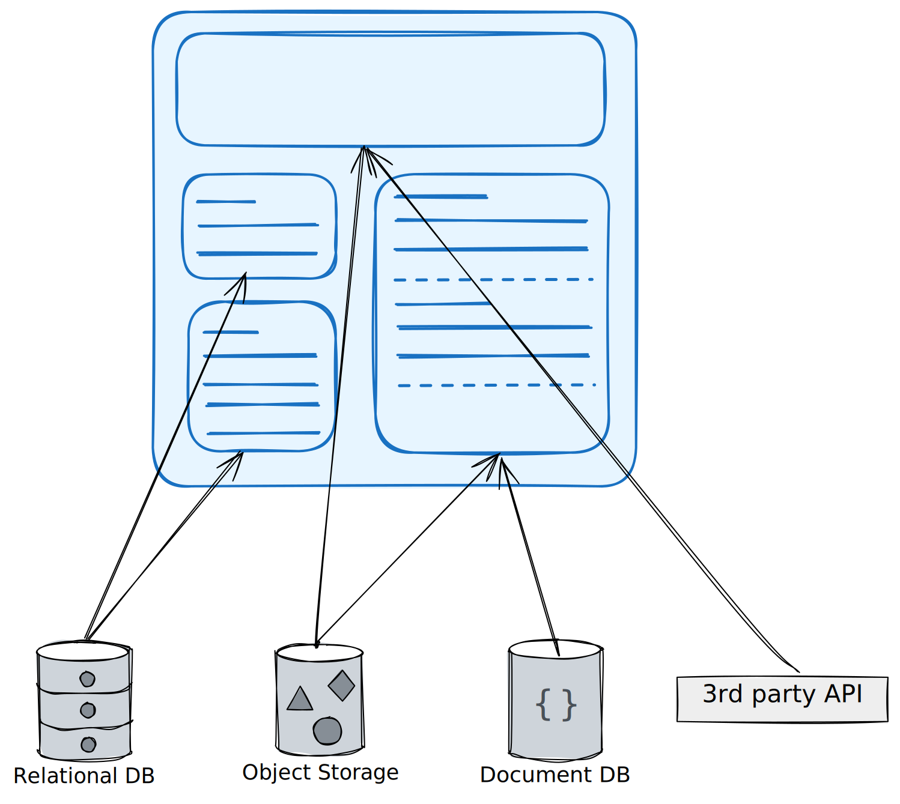
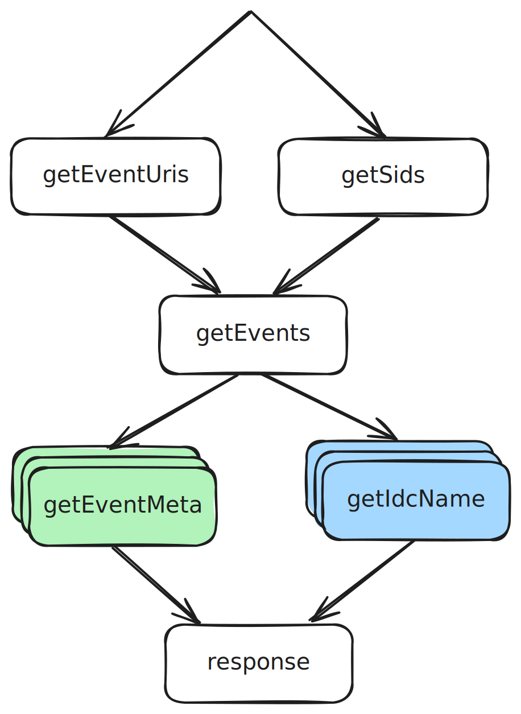
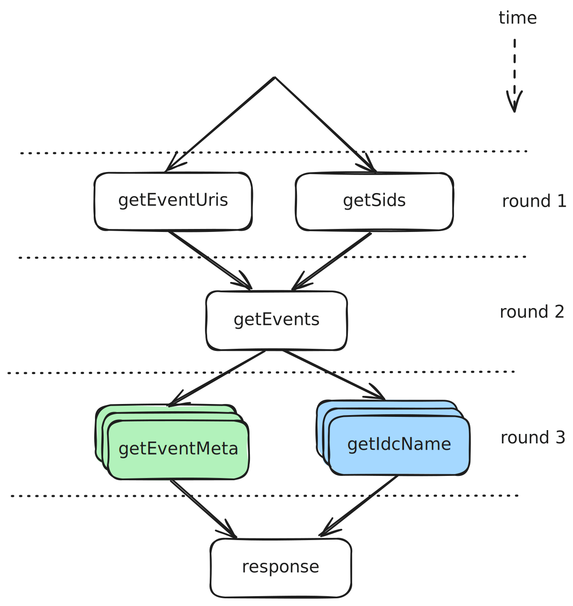
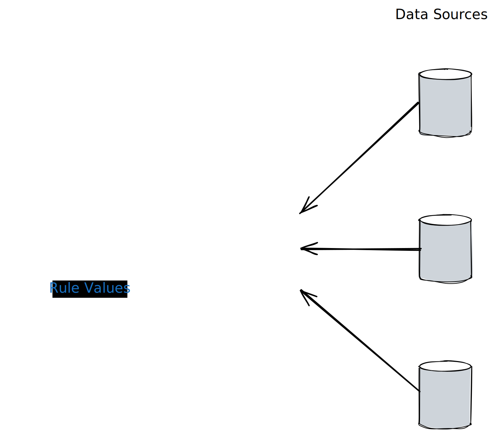

# There is no Fork: an Abstraction for Efficient, Concurrent, and Concise Data Access

Simon Marlow, Louis Brandy, Jonathan Coens, Jon Purdy

<div class="abs-br m-6 text-sm">
  <a href="https://dl.acm.org/doi/10.1145/2628136.2628144" target="_blank">
    Paper
  </a>
</div>

<style>
h1 {
  font-size: 2.5rem !important;
  text-wrap: pretty;
}
</style>

<!--
Facebook's approach to efficient data fetching at scale.
This paper introduces Haxl, a framework that makes concurrency implicit in data-fetching operations.
-->

---
hideInToc: true
---

# Table of Contents

<Toc />

<style>
.slidev-toc {
  font-size: 1.5rem !important;
}
</style>

<!--
Quick overview of what we'll cover today. First, we'll discuss the fundamental problems with data access - why it's inefficient, sequential, and brittle. Then we'll explore why traditional concurrency approaches fall short. Finally, we'll see how Haxl solves these problems with automatic concurrency.
-->

---

# Data Access

Data access is common in programming.

<div class="flex gap-4 justify-between">

<div>

It usually becomes complex with multiple data sources.

- Web page rendering
- Script
- Build system
- Monitoring system
- etc.

</div>



</div>

---
hideInToc: true
---

# Data Access

What makes it inefficient, sequential and flaky?

<v-clicks>

I/O

- It's slow.


</v-clicks>

<!--
So what happened? What's wrong with data access? We've seen the title but what exactly makes it inefficient, or sequential, or flaky/brittle?
-->

---
hideInToc: true
---

# Data Access

What makes it inefficient, sequential and flaky?

I/O

- It's slow.

<v-clicks>

- It's hard to test.


- It's hard to debug.

<div class="w-96 mt-4">
  <blockquote class="flex flex-col gap-1">
    <p class="text-lg">
      “It breaks on my machine.”
    </p>
    <p class="text-right text-lg">—<cite>Your No. 1. Customer</cite></p>
  </blockquote>
</div>

</v-clicks>

<!--
So I/O is slow - we all know that. But it also creates testing challenges because we need to mock external services and deal with flakiness. And debugging is even harder - it works on your machine, but breaks in production or on a customer's machine. This is where Haxl comes in. It addresses these problems by providing an abstraction that handles concurrency automatically, includes built-in caching for testability and consistency, and provides detailed execution traces for debugging.
-->

---

# Haxl

The framework that solves these problems (almost).

<div class="flex gap-4">

  <div class="w-108">
  
  Haxl is a Haskell framework that:

  - enables writing **sequential code** with **automatic concurrency**
  - provides **batching** requests to the same backend
  - and **built-in caching** for performance and correctness

  </div>

  <div class="flex justify-center flex-1">
    
  </div>
</div>

---

# Concurrency

You know well about concurrency:

<div class="flex flex-col gap-4">
  <div class="flex gap-4 justify-between">
    <p class="text-2xl">Java</p>

```java
CompletableFuture f1 = ...;
CompletableFuture f2 = ...;
allOf(f1, f2).join();
```

  </div>

  <div class="flex gap-4 justify-between">
    <p class="text-2xl">JavaScript</p>

```javascript
const [r1, r2] = await Promise.all([thing1, thing2])
```

  </div>

  <div class="flex gap-4 justify-between">
    <p class="text-2xl">Python 3</p>

```python
r1,r2 = await asyncio.wait([thing1(),thing2()])
```

  </div>

  <div class="flex gap-4 justify-between">
    <p class="text-2xl">Haskell</p>

```haskell
(r1,r2) <- concurrently thing1 thing2
```

  </div>
</div>

<style>
pre {
  width: 36rem !important;
  font-size: 1rem !important;
}
</style>

<!--
You might think, "We already have concurrency in all major languages!" And you're absolutely right. Java has CompletableFuture, JavaScript has Promise.all, Python has asyncio, and Haskell has the concurrently function. So what's the problem? Why do we need something new?
-->

---

# What's wrong with this then?

<v-clicks>

1. Mental overhead
    - You have to remember to do so (fork or async)
2. Performance
    - You might wait too early
    - ```java
      CompletableFuture f = ...;
      var result = f.join(); // blocks the execution to wait
      heavyComputation();    // could have been done during waiting!
      ```
3. <span class="text-blue-500">Colored</span> <span class="text-red-500">functions</span>
    - <span class="text-blue-500">Synchronous</span> functions and <span class="text-red-500">asynchronous</span> functions cannot be called isomorphically
    - Crafting concurrency imports **extra structure** to the code

</v-clicks>

<style>
li {
  font-size: 1.25rem !important;
}

pre {
  font-size: 1rem !important;
}
</style>

<!--
The problem with explicit concurrency is threefold. First, there's mental overhead - you have to remember to make things concurrent. It's easy to forget and accidentally write sequential code. Second, performance suffers if you wait too early. You might block on a future before doing other work that could have run in parallel. Third, and most importantly, there's the "colored functions" problem. Once you introduce async, it infects your entire codebase. Synchronous and asynchronous code can't mix easily, forcing you to restructure everything. Concurrency becomes a pervasive design constraint.
-->

---

# Why not concurrency by default?

Why sequential by default?

<v-clicks>

- Side effects
- But how often?
- What about when it comes to data access?

<p class="text-center !mt-8 text-lg">


</p>

The first two steps are <span class="underline decoration-blue-500 decoration-2 underline-offset-4">side-effects free</span>.

</v-clicks>

<style>
li {
  font-size: 1.25rem !important;
}
</style>

<!--
This raises an interesting question: Why is sequential execution the default in most languages? The main reason is side effects - running things in parallel can cause race conditions and unpredictable behavior. But how often is this actually a problem? Especially when it comes to data access? Think about the typical workflow: gather data, compute results, output them. The first two steps are usually side-effect free - they're just reading data and transforming it. Real-world examples include web page rendering where you fetch multiple resources, or build systems that analyze dependencies. These are perfect candidates for automatic concurrency.
-->

---
hideInToc: true
---

# Why not concurrency by default?

Example: the Events API





<!--
Let's look at a concrete example: Facebook's Events API. First, we fetch event URIs and session IDs - these are completely independent and could run in parallel. Then we use both results to fetch the actual events. Finally, we fetch metadata and IDC names for each event - again, all of these could be parallelized. The dependency graph on the screen shows clear opportunities for concurrency, but traditional imperative code would execute this sequentially, wasting time waiting for each operation to complete before starting the next.
-->

---

# Haxl Abstractions

Haxl provides an abstraction over concurrent I/O

| Layer          | Primitive                             | What It Does            |
|----------------|---------------------------------------|-------------------------|
| Declaration    | `Request`                           | Define WHAT data exists |
| Implementation | `DataSource`                        | Define HOW to get it    |
| Composition    | `Fetch`, `<*>`, `>>=`               | Describe WHAT you need  |
| Execution      | `runFetch`                          | When to actually fetch  |

<style>
table {
  font-size: 0.8rem !important;
  margin-top: .75rem !important;
  margin-bottom: 1rem !important;
}
</style>

<!--
Now let's see how Haxl solves this. Haxl is a Haskell library that simplifies access to remote data. The key insight is to separate four concerns. Declaration - you define what data exists using Request types. Implementation - you define how to fetch it with DataSource instances. Composition - you describe what you need using Fetch operations and combinators. Execution - Haxl decides when to actually fetch the data. This separation enables automatic concurrency. You write sequential-looking code, but Haxl analyzes dependencies and fetches data in parallel. It also provides batching to reduce round trips, and built-in caching for consistency and debugging.
-->

---

# Example: Events API

<div class="flex gap-4 justify-between items-center">

```haskell
data Request a where
  GetEventUris :: Request [EventUri]
  GetSids      :: Request [Sid]
  GetEvents    :: [EventUri] -> [Sid] -> Request [Event]
  GetEventMeta :: EventUri -> Request EventMeta
  GetIdcName   :: Event -> Request IdcName

do
  eventUris <- getEventUris
  sids <- getSids
  events <- getEvents eventUris sids
  eventMetas <- mapM getEventMeta events
  idcNames <- mapM getIdcName events
  ...
```


</div>

<style>
pre {
  width: 30rem !important;
  font-size: 0.8rem !important;
}
</style>

<!--
Here's the Events API example rewritten with Haxl. First, we declare our request types using a GADT - this defines what data we can fetch. Then we write our business logic in do-notation, which looks completely sequential. We fetch event URIs, then session IDs, then events, then metadata and IDC names. But look at the diagram on the right - Haxl automatically parallelizes independent fetches! GetEventUris and GetSids run in parallel in the first round. Then all the GetEventMeta and GetIdcName calls run concurrently in later rounds. We wrote simple, sequential code, but got maximum concurrency for free.
-->

---

# How it works (really briefly)

Crux: How to discover and express the independence of computations?

Expression: Applicative `<*>` instead of Monad `>>=`

- `>>=` combines things sequentially
- `<*>` combines things in parallel

```haskell
(>>=) :: Monad       m => m a        -> (a -> m b) -> m b

(<*>) :: Applicative f => f (a -> b) -> f a        -> f b
```

As `<*>` implemented by Haxl,
it can discover the independence of computations
and combine them in parallel.

<style>
pre {
  margin-top: 1.5rem !important;
  margin-bottom: 2rem !important;
  font-size: 1rem !important;
}
</style>

<!--
So how does this magic work? The crux is discovering which computations are independent. The key is using the Applicative functor's angle-bracket operator instead of the Monad's bind operator. The bind operator combines things sequentially - the second computation depends on the first's result. But the Applicative operator combines things that don't depend on each other. Haxl's implementation of this operator can discover independence and execute things in parallel. This is the theoretical foundation that makes automatic concurrency possible.
-->

---
hideInToc: true
---

# How it works (really briefly)

Crux: How to discover and express the independence of computations?

Data-dependencies aren't first-class
- thus compiler support is needed

<v-click>

The *ApplicativeDo* compiler extension (Added to GHC 8.0, 2016)

````md magic-move
```haskell
do
  eventUris <- getEventUris
  sids <- getSids
```
```haskell
do
  (eventUris, sids) <- (,) <$> getEventUris <*> getSids
```
````

</v-click>

<v-click>

and reduces to (at runtime)

```haskell
fetch [GetEventUris, GetSids]
```

Haxl will call the `fetch` function with the list of blocked requests

</v-click>

<!--
But there's a problem - data dependencies aren't first-class in the language. The compiler can't automatically figure out which computations are independent just by looking at do-notation. That's where GHC's ApplicativeDo extension comes in. It was added to GHC 8.0 in 2016, specifically to support patterns like Haxl. With ApplicativeDo, when you write sequential-looking do-notation, the compiler analyzes the data dependencies. It transforms independent bindings to use the Applicative operator instead of the Monad operator. So our sequential code gets automatically rewritten to expose parallelism opportunities.
-->

---

# Batching & Caching

When your I/O becomes data

**Batching**

- Dependant on the `DataSource` implementation
- Reduces network round trips

```sql
SELECT * FROM event_meta WHERE uri = 1;
SELECT * FROM event_meta WHERE uri = 2;
-- ...
-- batches into
SELECT * FROM event_meta WHERE uri IN (1, 2, /* ... */);
```

**Caching**

- Performance - In-memory cache during each run
- Correctness - Consistent view of data within one run
- Debuggability - The cache records all the I/O that happened

<!--
When your I/O operations become data structures, you unlock two powerful optimizations. First, batching. If your DataSource supports it, multiple requests can be combined into a single network call. This dramatically reduces latency and network overhead. Second, caching. Haxl maintains a per-run cache that provides multiple benefits: Performance - repeated requests are served from cache. Correctness - you get a consistent view of data within a single run, no dirty reads. Modularity - different components don't need to coordinate their caching strategies. And crucially for debugging - the cache records every I/O operation that happened. You can dump this trace to reproduce issues or diagnose performance problems in production.
-->

---

# Haxl in Facebook

<div class="flex gap-2">

  <div class="w-108">

  - Sigma, a **rule engine** used to catch spam, malware, etc.
  - **Many different data sources** for accessing Facebook services
  - Generates Haskell code (over 200k loc) from rules
  - Haxl enables:
    - Rule authors **don't worry about concurrency**
    - Caching and memoization happen **automatically**

  </div>

  

</div>

<!--
So how is Haxl used in practice at Facebook? It powers Sigma - their rule engine for spam detection. Sigma generates over 200,000 lines of Haskell code from high-level rules written by security analysts. Haxl is crucial here because rule authors can focus purely on the detection logic without worrying about performance. They write sequential code that describes what data they need, and Haxl automatically discovers concurrency opportunities. Caching and memoization happen automatically, ensuring efficient execution without manual optimization. This demonstrates how Haxl enables non-experts to write efficient concurrent code - the security analysts don't need to be concurrency experts.
-->

---
layout: center
class: text-center
hideInToc: true
---

# Thank you

<div class="mt-12">

Paper: [There is no Fork: an Abstraction for Efficient, Concurrent, and Concise Data Access](https://dl.acm.org/doi/10.1145/2628136.2628144)
 
GitHub: [github.com/facebook/Haxl](https://github.com/facebook/Haxl)

  <div class="text-left text-xs pt-8">

  References:

  - ["Haxl: A Big Hammer for Concurrency" by Simon Marlow](https://www.youtube.com/watch?v=sT6VJkkhy0o)
  - [Facebook open sources Haxl - Hacker News](https://news.ycombinator.com/item?id=7873933)

  </div>

</div>

<!--
Final slide
-->
