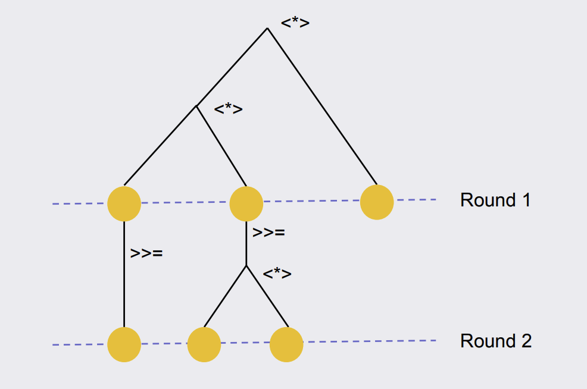

# Notes on "Haxl - the big hammer for concurrency" talk

> This is a watching note on the “Haxl - the big hammer for concurrency” talk.

What’s wrong with native concurrency solutions?

- I have to remember to do it
- I might wait too early
- Concurrency clutters the code
- Have to fix the awaits when refactoring
- Refactoring is harder due to the extra structure

One reason that we have to write code in such style is side effects. You can’t just concurrently run everything in your program, may lead to side effects interleaving in some non-deterministic way and becomes hard-to-interpret.

What if there are no side effects?

Imagine a process that gathers data from one or multiple data sources, makes decisions and finally takes actions. There are no side effects in the first two steps. And this happens quite often in our daily work, e.g. rendering a web page. In this scenario, concurrency might be the better default.

Haxl is a Haskell framework that provides an abstraction over concurrent I/O, and it works best with ApplicativeDo, the compiler extension added to GHC.

Example… (TODO: find a good example which is related to our business)

With Haxl, you write the code in sequential way that you wanted, and you get parallelism for no extra effort. Thus, we **flipped the default** from sequential to concurrent: from everything being forced to be sequential and having to say which things are concurrent to everything is concurrent unless you say so or unless you have a data dependency.

How it works?

```haskell
(>>=) :: Monad m => m a -> (a -> m b) -> m b
```

Monad bind operator is the sequential composition. As you can see, `m a` is the dependency of `a -> m b`.

```haskell
(<*>) :: Applicative f => f (a -> b) -> f a -> f b
```

`<*>` combines things in parallel (given a suitable implementation). The two arguments to the operator are independent - the left is a computation that returns a function and the right is a computation that returns a value, then finally the function is applied to the value.

With ApplicativeDo, your sequential code is transpiled to applicative style where possible (no dependency):

```haskell
do
	latest <- getLatestVersion
	hosts <- getHosts
	...
```

Turns out at compile time:

```haskell
do
	(latest, hosts) <- (,) <$> getLatestVersion <*> getHosts
	...
```

Instead of:

```haskell
	getLatestVersion >>= \latest ->
    getHosts >>= \hosts ->
    ...
```

Haxl implemented the splat operator in order to provide parallelism.

At runtime, Haxl will evaluate this computation in order to find a list of tasks that it can do in parallel, and it will pass the extracted list to a back-end, which is the _fetch_ functions **you provided**.

Given a list operations, you can choose the implementation on how to do them in parallel, i.e. overlapping them all using threads, or batching them together and send a single request to the data source.

A request is a graph of data fetches and dependencies.



Haxl treats I/O as data and data is inspectable and comparable. Thus, Haxl makes a per-run cache of all the requests/responses that have happened so far. Caching has benefits:

- for performance, of course
  - bonus: one step further, you can cache computation more than I/O results
- for correctness (same response for same request, consistent view inside one fetch)
- for modularity
  - normally implement caching requires extracting shared module that is coupled with consumers
  - centralized caching abstracts this away
- for debugging, the cache records all the I/O, which could be dumped (on failure or other scenarios) for repro/diagnose (compared to traditional logging)

The big hammer:

- You write:
  - Boilerplate for your I/O
- You get:
  - Automatic concurrency
  - Caching
  - Testability (record/replay, mocking)
  - Debuggability (capture run, repro later)

Follow ups:

- Rounds are restrictive, sometimes waiting until all fetching during one run is not optimal. Haxl 2 provides a way for you to control if some I/Os should immediately unblocks the following computation, instead of being blocked by other pending fetching.
- (from the paper) Side-effects could be applied after `runFetch`s.

Haxl clones (IMO not important):

- Stitch (Scala)
- clump (Scala)
- Fetch (Scala)
- muse (Clojure)
- urania (Clojure)
- …
